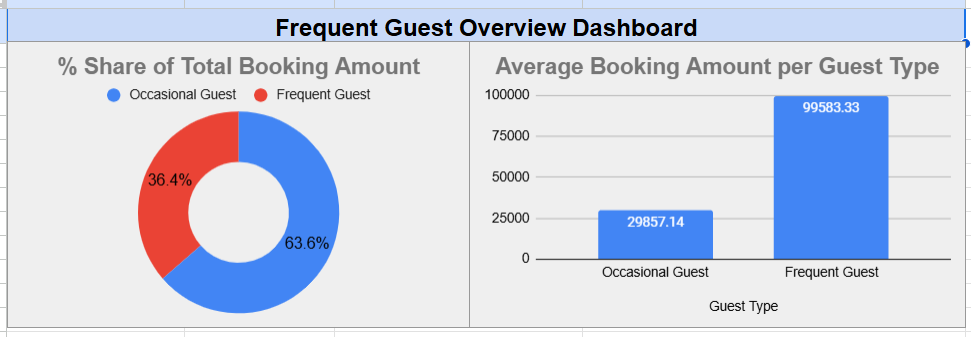
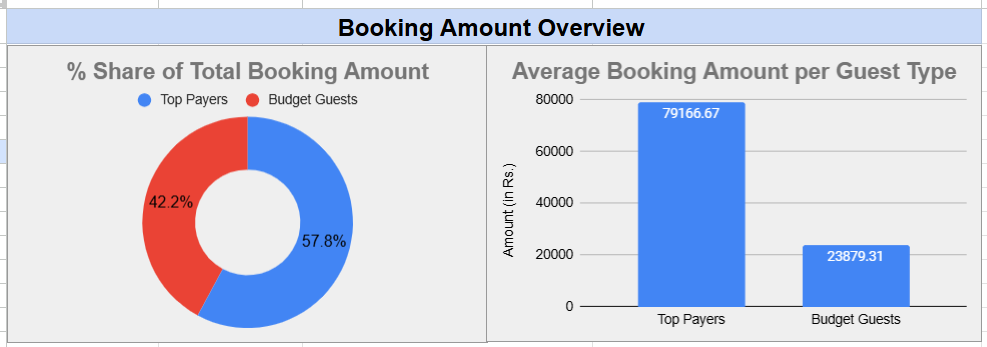
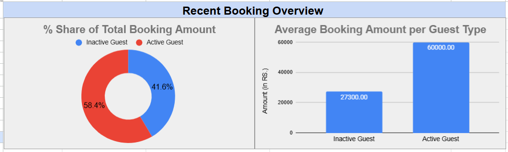
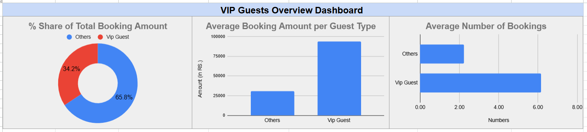

# 🏨 Ibiz Hotel - RFM Booking Analysis (April–June 2024)

Ibiz, a business hotel, seeks a detailed analysis of booking data as of July 2024, focusing on the past three months (April, May, and June), to identify frequent, recent, and high-value guests. This RFM (Recency, Frequency, Monetary) analysis aims to uncover key booking patterns and trends to optimize services and enhance the guest experience.

---

## 🎯 Objective

### ✅ Frequent Guest Overview
Classify guests into:
- **Frequent Guests**: 6 or more bookings
- **Occasional Guests**: Fewer than 6 bookings  
Analyze their:
- % share of total booking amount
- Average booking amount  
To improve loyalty strategies.

### ✅ Spending Overview
Segment guests by total spend:
- **Top Payers**: Spent ₹50,000 or more
- **Budget Guests**: Spent under ₹50,000  
Analyze their:
- % share of total booking amount
- Average booking amount  
To support pricing strategy optimization.

### ✅ Recency Overview
Categorize based on last booking:
- **Active Guests**: Booked within the last 15 days
- **Inactive Guests**: Last booking more than 15 days ago  
Measure:
- % share of booking amount
- Average booking value  
For customer retention targeting.

### ✅ VIP Guest Overview
Identify top 5 guests based on:
- Frequency, spending, and recency  
Compare with other guests in terms of:
- Average booking amount
- Average number of bookings
- % share of revenue  
To design personalized services and rewards.

---

## 📊 Dataset

**Booking Data (April–June 2024)**  
Each record contains:
- Booking ID
- Guest Name
- Room Type
- Number of Days Stayed
- Booking Date
- Amount Paid

---

## 🧹 Data Cleaning & Preparation

- Cleaned guest records and dates
- Parsed and corrected booking duration and payments
- Segmented guests based on frequency, monetary value, and recency
- Created derived columns for RFM categorization
- Built pivot tables and visual dashboards in **Google Sheets**

---

## 📈 Dashboards

### 👥 Frequent Guest Overview

### 💰 Spending Overview

### ⏱ Recency Overview

### 👑 VIP Guest Overview

---

## 🛠 Tools Used
- 📊 Google Sheets
- 📐 Pivot Tables
- 📎 Excel Formulas (IF, COUNTIFS, SUMIFS)
- 🎯 RFM Segmentation Logic

---

## 👤 Author

**Shubham Kumar**  
[LinkedIn Profile](https://www.linkedin.com/in/shubham35/)  
📧 shubhamkr3524@gmail.com

---

## 📁 File

- `Shubham_Ibiz Business Hotel.xlsx` – Full workbook with data and analysis
